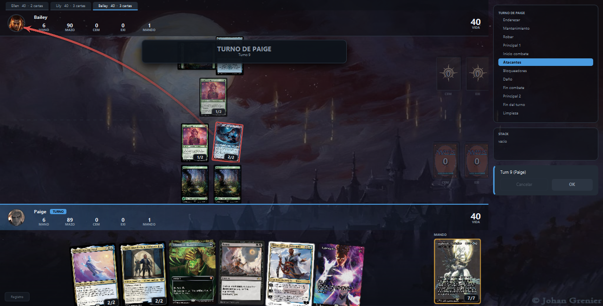
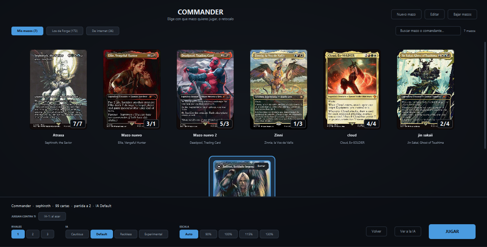
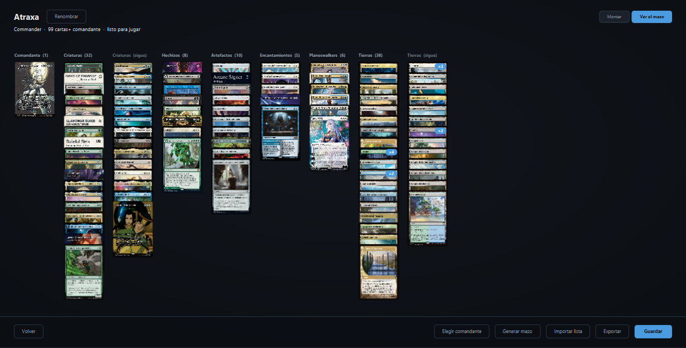
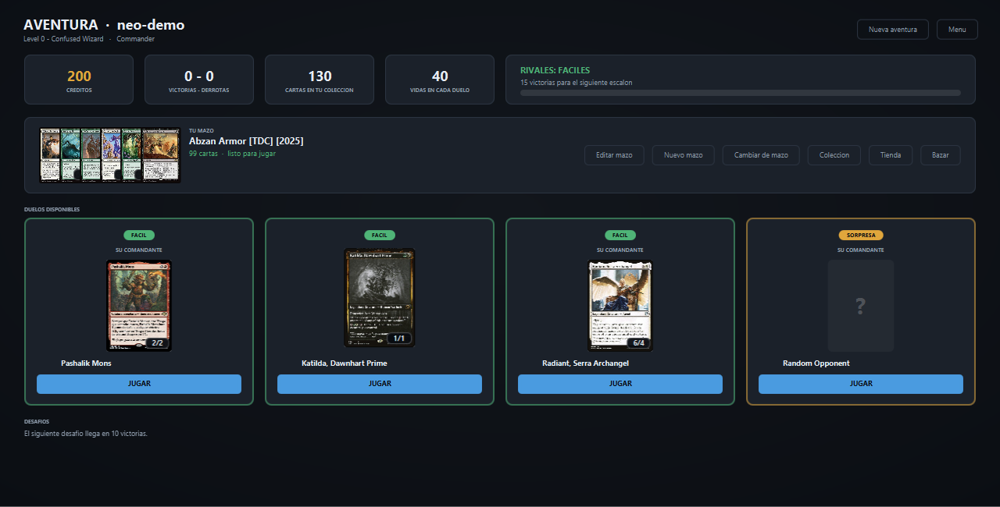
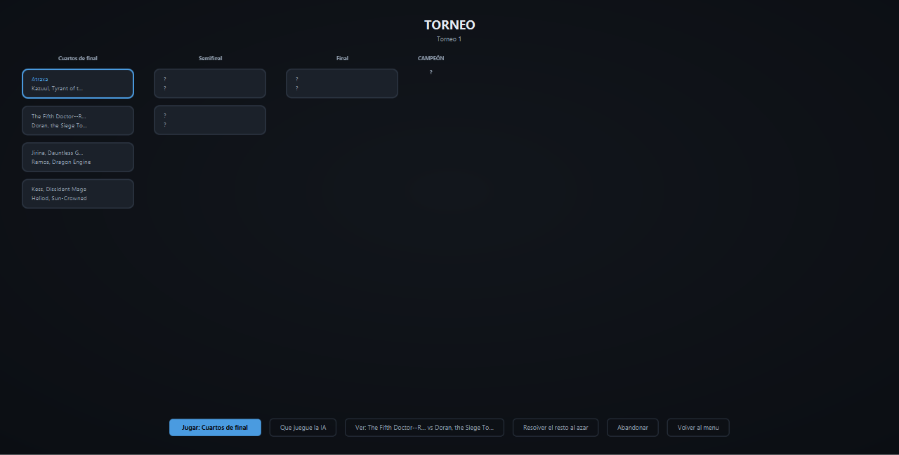

# NeoForge

Una interfaz nueva para jugar a **Magic: the Gathering contra la IA**, sobre el motor de
reglas de [Forge](https://github.com/Card-Forge/forge).

Forge tiene las reglas, las 33.000 cartas y una IA que lleva años puliéndose. Lo que no
tiene es una interfaz de este siglo. NeoForge es eso y sólo eso: presentación. **Ni una
línea de reglas es nuestra.**



💬 **Discord:** [discord.gg/fF5Tn7Z2pv](https://discord.gg/fF5Tn7Z2pv) — fallos, ideas y gente con
la que jugar en red.

---

## Qué hace

- **Commander contra la IA**, y también Estándar, Brawl, Oathbreaker y Tiny Leaders.
  A cuatro jugadores se puede ver **la mesa de todos los rivales a la vez**, en vez de una
  y pestañas (se enciende en Ajustes; ver más abajo).
- **Ascenso**, un modo roguelike propio: una run por un mapa de nodos ramificado, con la
  vida arrastrándose entre combates, un mazo que se forma dentro de la run, 37 reliquias,
  24 eventos, tienda, descansos y diez niveles de Ascensión con desbloqueos por hitos.
- **Aventura** — el Adventure de Forge **tal cual** (mapa del mundo, pueblos y mazmorras),
  con los combates y el editor de mazos de NeoForge dentro. Se abre en su propia ventana.
  Sólo en Windows por ahora.
- **Quest** (el modo de campaña clásico de Forge): duelos, 37 desafíos, 93 mundos, tienda
  de sobres, bazar y colección.
- **Draft** y **Sellado**, con elección de expansión y el mazo editable con tu pool.
- **Torneo** por eliminación directa, de 4 u 8.
- **Puzzles**: los 372 que trae Forge.
- **Partida privada en red** (IP directa), usando el netcode del propio Forge.
- **Tutorial** de tres lecciones, sobre mesas preparadas.
- **Deck builder** con catálogo buscable, curva de maná, cambio de arte e importación de
  decklists de Moxfield y Archidekt.
- **Diez idiomas**, los mismos que Forge, y en ocho de ellos también los nombres de las cartas.
- **Atajos de teclado configurables**, con tres estilos de partida para empezar: el de
  NeoForge, el de Forge y el de Arena (ver más abajo).

### Atajos de teclado

Ajustes → *Teclado* → *Ver y cambiar* (o **H** durante una partida) abre la lista de atajos.
Se consultan y se cambian ahí mismo: clic en el hueco y se pulsa la tecla nueva; Retroceso la
quita y Esc cancela. Cada acción admite dos teclas.

- **NeoForge**, el de fábrica: Espacio pasa prioridad, Ctrl+E pasa hasta el final del turno,
  Ctrl+A ataca con todo, Ctrl+Z deshace, Z amplía la carta bajo el ratón, L abre el registro,
  S despliega el stack, Ctrl+Q se rinde (preguntando antes) y H enseña los atajos.
- **Forge**: lo mismo, más Y / N (siempre sí / siempre no al disparo de arriba del stack) y
  P (pasar la prioridad sola o no).
- **Arena**: Espacio pasa, Enter y Mayús+Enter pasan el turno, Z deshace y Ctrl+Mayús es el
  control total.

Esc no se puede reasignar: abre siempre la pausa y los ajustes, que es por donde se llega a
cambiar el resto.

### Ver todas las mesas a la vez

En Commander a tres o cuatro jugadores, Ajustes → *Ver la mesa de todos los rivales a la vez*
sustituye las pestañas de rival por una mesa por rival, en fila. **Viene apagado**, y no por
prudencia: repartir el ancho entre tres deja las cartas bastante más pequeñas, así que es una
decisión de gusto. Con él encendido se gana ver de un vistazo lo que tiene cada uno, y elegir
a quién atacas sin cambiar de pestaña primero.

Dos cosas que conviene saber:

- **Actívalo antes de empezar la partida.** Es un ajuste de disposición de la mesa.
- Si la ventana no da para tres barras de jugador enteras, se sigue jugando con pestañas y
  se avisa por qué: una barra recortada esconde la vida del rival, que es justo el dato por
  el que decides el combate.

Para leer una carta pequeña: **clic derecho** la amplía, y **Ctrl + rueda** acerca la mesa.

| | |
|---|---|
|  |  |
|  |  |

---

## Jugar en un Mac

En [Releases](https://github.com/AdrianLopez98/NeoForge/releases) hay un `.dmg` para
**Apple Silicon** (`arm64`) y otro para **Intel** (`x64`). Trae su propio Java: se abre,
se arrastra NeoForge a Aplicaciones y listo. Todo funciona igual que en Windows **salvo la
Aventura** (el Adventure de Forge), que en Mac todavía no está.

La primera vez macOS lo bloquea, porque no está firmado con una cuenta de desarrollador
de Apple: doble clic, se acepta el aviso, y **Ajustes del Sistema → Privacidad y
seguridad → Abrir igualmente**. Las instrucciones completas van dentro del `.dmg`
(`LEEME-MAC.txt`).

En un Mac, **Cmd hace de Ctrl** (Cmd+Z deshace), **Ctrl+clic es clic derecho** (amplía la
carta), **pellizcar** acerca la mesa y **Cmd+arrastrar** la mueve. Los datos van donde
los pone Forge en un Mac: `~/Library/Application Support/Forge`.

Los `.dmg` los compila [el flujo `macos`](.github/workflows/macos.yml) en las máquinas
Mac de GitHub, que además arranca la aplicación ya empaquetada y juega una partida antes
de dar el paquete por bueno. Para compilarlo en un Mac propio: `mac/empaquetar.sh`.

---

## Cómo está construido

Forge separa motor y presentación con un contrato formal, y ya hay **dos** interfaces
distintas enchufadas ahí (Swing y libGDX). Ésta es la tercera. No es un parche: es el
patrón previsto.

```
  forge-gui-desktop (Swing)   forge-gui-mobile (libGDX)   forge-gui-neo (JavaFX)
        │  IGameController                        ▲  IGuiGame
        ▼                                         │
  forge-gui   ·   la costura:  HostedMatch · AbstractGuiGame · PlayerControllerHuman
        │  PlayerController                       ▲  GameView · CardView · GameEvent
        ▼                                         │
  forge-ai   ·   forge-game   ·   forge-core      (el motor: reglas, stack, cartas)
```

Todo el código de este repositorio vive en **`forge-gui-neo/`**, un módulo Maven más del
reactor de Forge. Es JavaFX 21 sobre Java 17.

La regla que sostiene el proyecto: **no se modifica ningún fichero que ya exista en el
repositorio de Forge.** La única excepción es una línea en el `pom.xml` padre. Así
`git rebase upstream/master` nunca da conflictos y cada actualización de Forge —con sus
cartas y expansiones nuevas— entra sin trabajo. Cuando el motor tiene un fallo que nos
afecta, se **envuelve** desde este módulo en vez de parchearlo.

---

## Compilar

Hace falta **JDK 17** (Forge lo exige con maven-enforcer) y Maven 3.9.

```bash
# 1. el motor
git clone https://github.com/Card-Forge/forge.git
cd forge
git checkout 746455d75515daabec62971e0544cf19c66356b3   # la base probada; master suele valer

# 2. este módulo, dentro
git clone https://github.com/AdrianLopez98/NeoForge.git /tmp/neoforge
cp -r /tmp/neoforge/forge-gui-neo .

# 3. la única línea que se toca de Forge: añadir el módulo al reactor
#    en pom.xml, junto a los otros <module>:
#        <module>forge-gui-neo</module>

# 4. compilar SIEMPRE dentro del reactor, con -am
export MAVEN_OPTS="-Dfile.encoding=UTF-8 -Xmx2g"
mvn -B install -DskipTests -pl forge-gui-neo -am
```

> **`-am` no es opcional.** Forge ata el plugin *flatten* a la fase `deploy`, no a
> `install`, así que los POMs que quedan en `~/.m2` conservan `${revision}` sin resolver y
> los módulos no se pueden consumir de forma aislada. Con `-am` se resuelve desde el
> reactor.

## Ejecutar

El directorio de trabajo tiene que ser `forge-gui-neo/`, para que `../forge-gui/` resuelva
`res/cardsfolder`, `res/editions` y el resto de recursos del motor.

```bash
cd forge-gui-neo
java -Dfile.encoding=UTF-8 -Xmx2g -cp "target/classes:target/lib/*" forge.neo.NeoMain ui
```

`target/lib/` lo rellena el `maven-dependency-plugin` en la fase `package`. El directorio
de recursos se puede mover con `-Dforge.assetsDir=...`, y todos los datos del jugador se
pueden meter dentro de la carpeta del juego con `-Dneo.dataDir=...`.

Sin argumentos, `NeoMain` lista los mazos. Con `ui` abre la ventana. Hay además una
familia de comprobadores que corren **sin ventana** (`deckcheck`, `draftcheck`,
`questcheck`, `tutorialcheck`, `lobbycheck`, `tournamentcheck`…), que es como se verifica
que un rebase de Forge no ha roto nada.

---

## Licencia

**GNU GPL v3**, la misma que Forge. Esto es obra derivada de Forge y no podría ser otra.
El texto completo está en [LICENSE](LICENSE).

Las **imágenes de las cartas no se distribuyen**: se descargan de
[Scryfall](https://scryfall.com) al jugar, igual que hace Forge.

## Aviso

No es un producto oficial. NeoForge no está afiliado, patrocinado ni aprobado por Wizards
of the Coast. *Magic: the Gathering*, los nombres de las cartas y sus ilustraciones son
propiedad de Wizards of the Coast LLC. Proyecto de aficionado, sin ánimo de lucro: no se
vende, no lleva publicidad y no se cobra por él. Ver [AVISOS.txt](AVISOS.txt).
